# 🐞 Issue Tracker

A full-stack **Issue Tracker** web application to manage projects, create tickets, assign team members, and visualize tasks on a Kanban board.

## 🌟 Features

* ✅ **User Authentication** (Login / Signup)
* ✅ **Create & Manage Projects**
* ✅ **Track Tickets with Kanban Board**
* ✅ **Assign Issues to Team Members**
* ✅ **Project Progress Tracking with Percentage**
* ✅ **Recent Issues Table on Dashboard**
* ✅ **Search & Filter Tickets**
* ✅ **Responsive UI with Tailwind CSS**
* ✅ **Team Collaboration & Invitations**

## 🔠 Tech Stack

| Frontend      | Backend  | Database |
| ------------- | -------- | -------- |
| React         | Node.js  | MongoDB  |
| Axios         | Express  | Mongoose |
| Framer Motion | JWT Auth |          |
| Tailwind CSS  |          |          |

## 📂 Folder Structure

```
issue-tracker/
🔺 client/        # React Frontend
🔺 server/        # Node.js Backend (API)
```

## 🚀 Getting Started

### 1️⃣ Clone the Repository

```bash
git clone https://github.com/ManojThamke/issue-tracker.git
cd issue-tracker
```

### 2️⃣ Install Dependencies

**For Backend:**

```bash
cd server
npm install
```

**For Frontend:**

```bash
cd ../client
npm install
```

### 3️⃣ Environment Variables

Create a `.env` file in the `server/` folder:

```
PORT=5000
MONGO_URI=your_mongodb_connection_string
JWT_SECRET=your_secret_key
```

### 4️⃣ Run the Application

**Backend:**

```bash
cd server
npm run dev
```

**Frontend:**

```bash
cd ../client
npm run dev
```

Open your browser at: **[http://localhost:3000](http://localhost:3000)**

---

## 📷 Screenshots

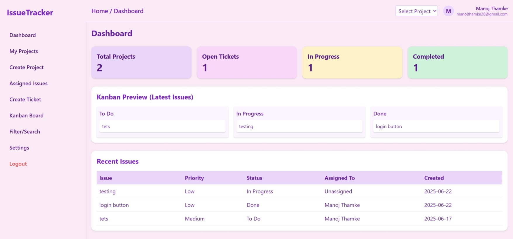
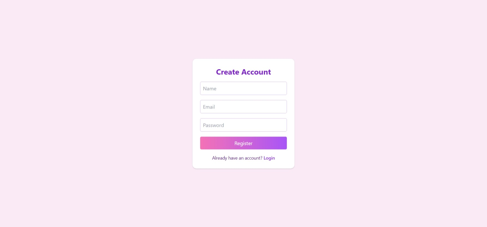 
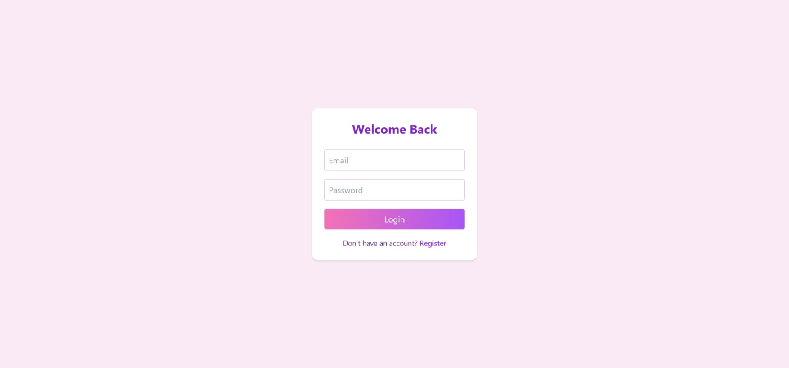 
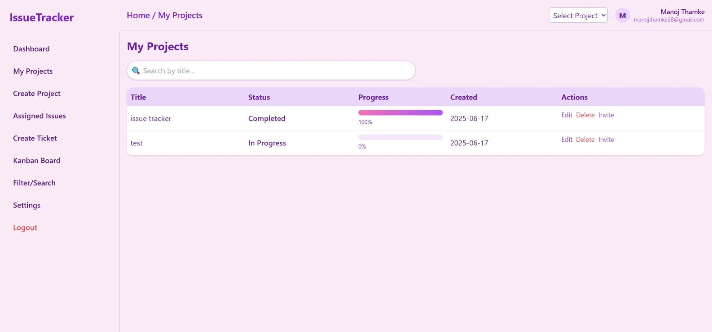 
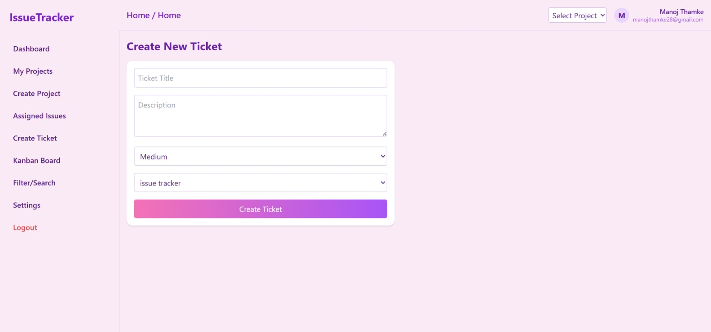 
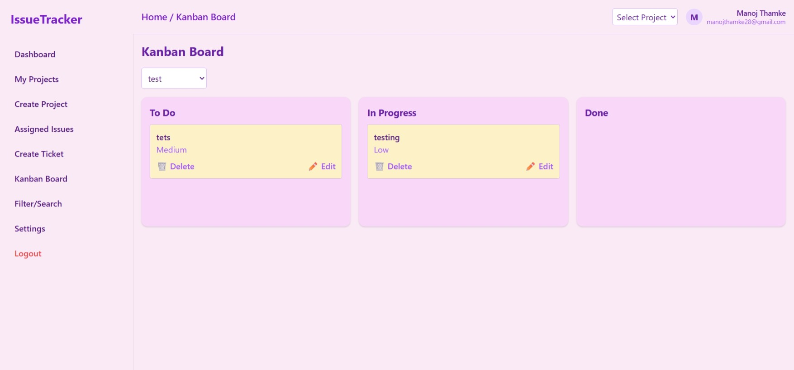 
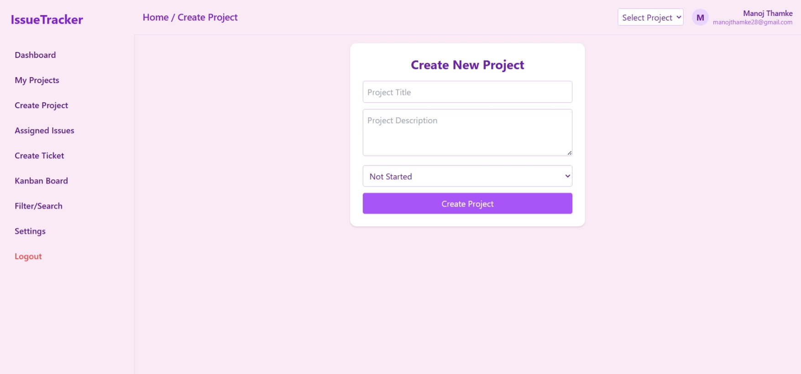 
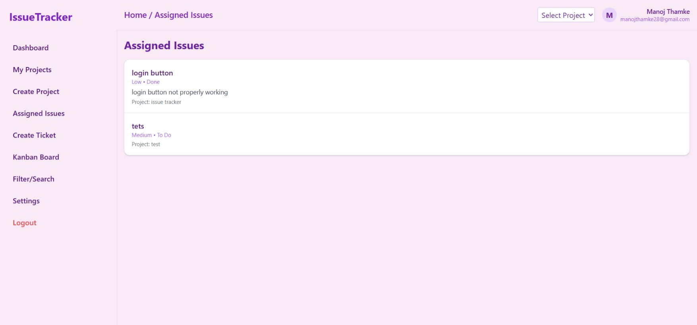
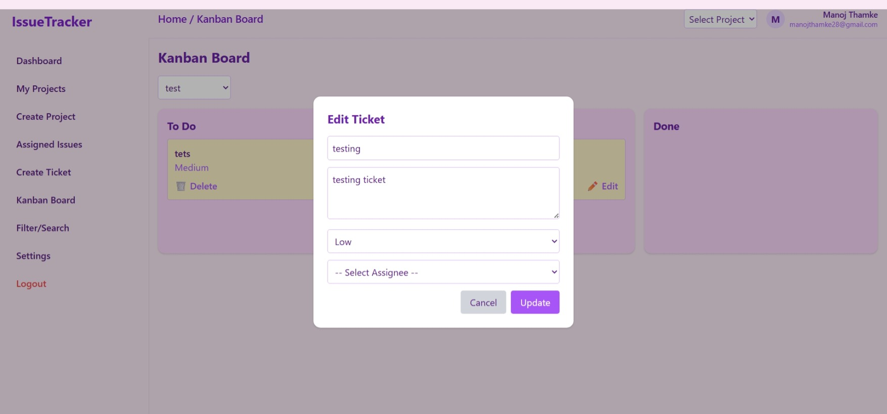 
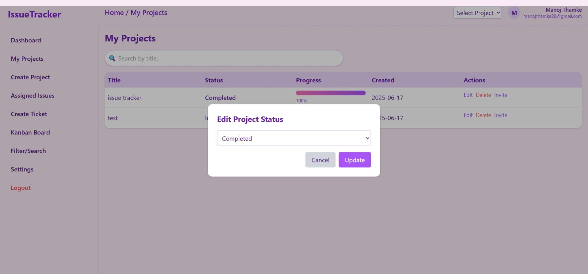 
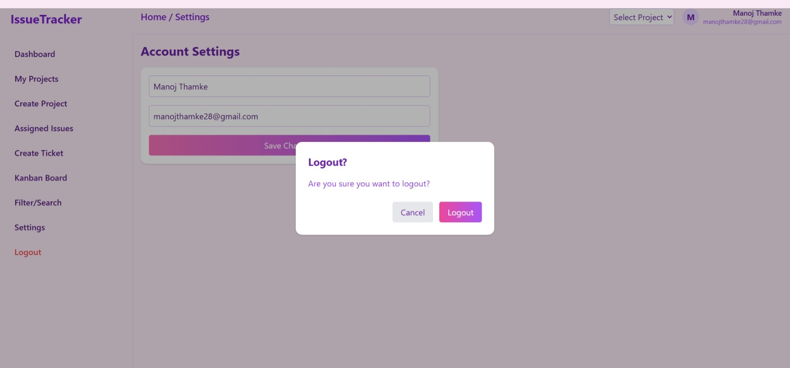 
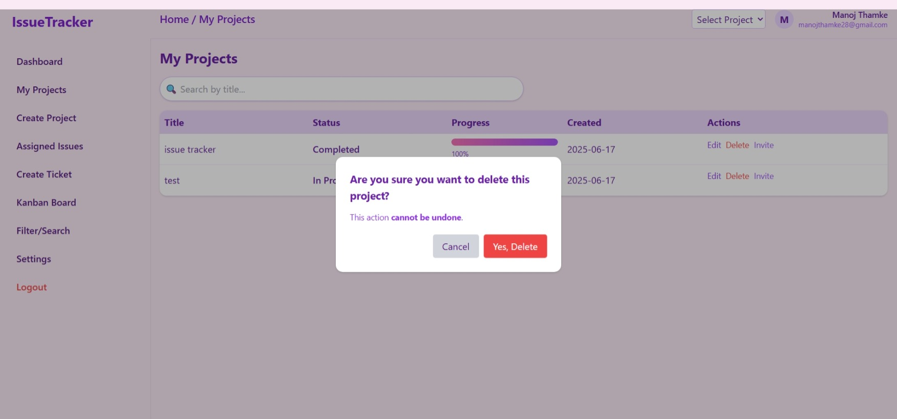 
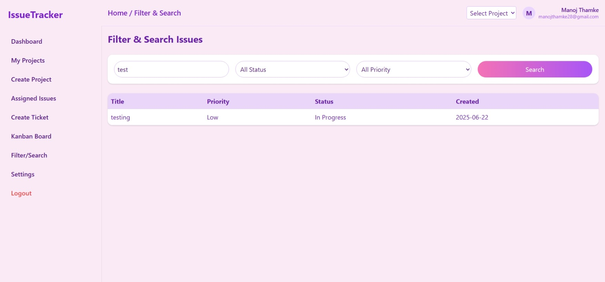 
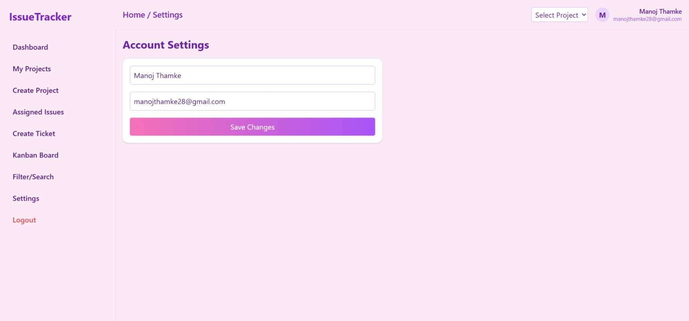 


---

## ✨ Upcoming Features

* [ ] Email Invitations for Team
* [ ] Project Roles & Permissions
* [ ] Deployment on Render / Vercel

## 👤 Author

**Manoj Thamke**
[GitHub](https://github.com/ManojThamke)

---
